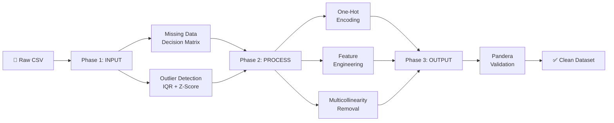
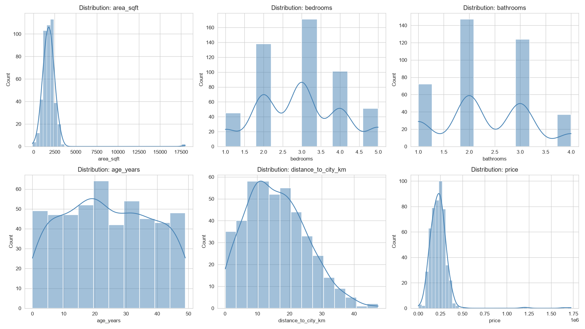
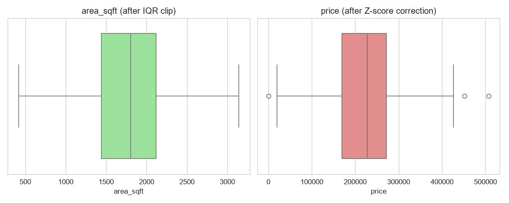
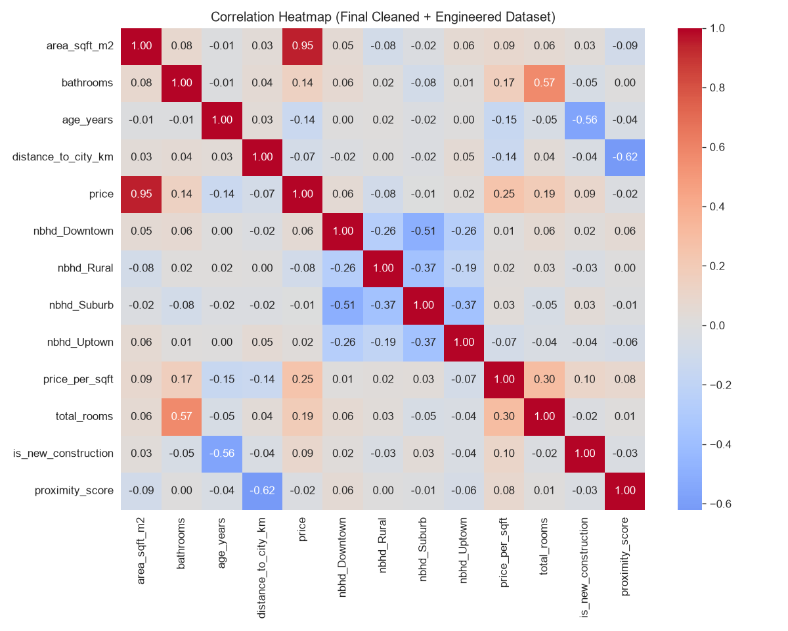

<div align="center">

# 🏠 Advanced EDA & Feature Engineering

### Transforming raw, chaotic housing data into a mathematically clean, ML-ready dataset

[](https://www.python.org/)
[](https://pandas.pydata.org/)
[](https://numpy.org/)
[](https://scikit-learn.org/)
[](https://pandera.readthedocs.io/)
[](#license)

<p>
  <a href="#-quickstart">Quickstart</a> •
  <a href="#-what-this-project-does">What it does</a> •
  <a href="#-pipeline-architecture">Architecture</a> •
  <a href="#-results">Results</a> •
  <a href="#-requirements-coverage">Requirements coverage</a>
</p>

</div>

---

## 📌 Overview

Machine learning models don't reason — they optimize numbers. Feed them
messy data and they'll confidently learn the wrong pattern. This project
takes a **realistic, messy housing dataset** (missing values, outliers,
duplicate rows, inconsistent text formatting) and runs it through a
production-style cleaning pipeline:

> **Raw chaos → Validated, mathematically clean, ML-ready data**

Built as **Project 1** of the DecodeLabs Data Science Industrial Training
Kit, fully implementing the brief *plus* the advanced enterprise-grade
extensions (missingness decision matrix, One-Hot Encoding, multicollinearity
removal, and runtime schema validation).

---

## ✨ What This Project Does

| Stage | Technique | Why it matters |
|---|---|---|
| 🧹 **Missing Data** | Decision Matrix: Drop (<5%) → Median/Mode (5–20%) → KNN (>20%) | Picks the right fix per column instead of one blanket rule |
| 🎯 **Outlier Handling** | IQR + Z-Score, with **Winsorization** (clipping) | Removes data-entry errors without losing rows |
| 🔢 **Encoding** | One-Hot Encoding (not Label Encoding) | Avoids inventing false numeric order between categories |
| 🧮 **Feature Engineering** | 4 new predictive features | Gives the model signal it can't see in raw columns |
| 🔗 **Multicollinearity** | Auto-detects & removes correlated pairs (>0.80) | Prevents unstable, redundant model inputs |
| ✅ **Validation** | Pandera schema contract | Catches bad data before it reaches a model or API |

---

## 🚀 Quickstart

```bash
# 1. Clone and enter the project
git clone <your-repo-url>
cd pr

# 2. Create & activate a virtual environment
python -m venv venv
venv\Scripts\activate        # Windows
source venv/bin/activate     # macOS/Linux

# 3. Install dependencies
pip install -r requirements.txt

# 4. Run the pipeline
python src/01_pipeline.py
```

Output lands in `outputs/`: the cleaned CSV plus 3 diagnostic charts.

<details>
<summary><strong>🖥️ Prefer a browser UI instead of the terminal?</strong></summary>
<br>

This repo also includes a Flask + HTML/CSS/JS web app (`app.py`) so you can
upload a CSV, run the pipeline, and see before/after results in your browser.

```bash
python app.py
```
Then open **http://localhost:5000**.

</details>

---

## 🏗️ Pipeline Architecture



---

## 📂 Folder Structure

```
pr/
│
├── data/
│   └── raw_house_listings.csv      # messy "raw" input dataset
│
├── src/
│   ├── 00_generate_raw_data.py     # generates the synthetic messy data
│   └── 01_pipeline.py              # ⭐ main project script — run this
│
├── outputs/                        # generated by the pipeline
│   ├── cleaned_house_listings.csv  # final ML-ready dataset
│   ├── 01_raw_distributions.png
│   ├── 02_outliers_after_treatment.png
│   └── 03_correlation_heatmap.png
│
├── app.py                          # optional Flask web UI
├── templates/ , static/            # web UI frontend assets
├── requirements.txt
└── README.md
```

---

## 📊 Results

<table>
<tr>
<td width="50%">

**Before cleaning**
- 506 rows, 8 columns
- Missing values: 3%–25% across columns
- 6 duplicate rows
- Inconsistent text casing (`Suburb` / `suburb` / `  Suburb  `)
- Data-entry-error outliers (e.g. 17,500 sq ft listing)

</td>
<td width="50%">

**After cleaning**
- 470 rows, 13 columns
- **0** missing values
- **0** duplicates
- 4 new engineered features
- Pandera-validated schema contract

</td>
</tr>
</table>

**Raw data distributions:**



**Outlier treatment (before → after):**



**Final feature correlation heatmap:**



---

## ✅ Requirements Coverage

<details>
<summary><strong>Click to expand full requirement-to-code mapping</strong></summary>
<br>

| Requirement | Implementation |
|---|---|
| Missing data via Mean/Median/KNN | `missing_data_decision_matrix()` |
| Missingness Decision Matrix (<5% / 5–20% / >20%) | `missing_data_decision_matrix()` |
| Outlier handling via Z-Score or IQR | `handle_outliers()` |
| Winsorization (clip, not delete) | `handle_outliers()` — uses `.clip()` |
| 3+ engineered features | `engineer_features()` — 4 features created |
| Vectorized operations (no loops) | All steps use pandas/NumPy vector ops |
| One-Hot Encoding | `one_hot_encode()` |
| Multicollinearity Eradication (>0.80 corr) | `remove_multicollinearity()` |
| Pandera schema validation | `validate_with_pandera()` |
| Feast feature store | *Not implemented* — needs production DB/Redis infra; explained conceptually below |

</details>

---

## 🧠 Pipeline Phases in Detail

<details>
<summary><strong>Phase 1 — Input (Securing Fidelity)</strong></summary>
<br>

1. Load raw data, inspect shape, dtypes, missing %, duplicates.
2. Drop duplicate rows, standardize text casing.
3. **Missing Data Decision Matrix** — routes each column by % missing:
   - `< 5%` → drop rows
   - `5–20%` → median/mode imputation
   - `> 20%` → KNN imputation
4. **Outlier handling** — IQR for `area_sqft`, Z-score for `price`, both
   clipped instead of deleted to preserve row count.

</details>

<details>
<summary><strong>Phase 2 — Process (Vectorized Engine)</strong></summary>
<br>

5. One-Hot Encode `neighborhood` — avoids implying false ordinal order.
6. Engineer 4 new features:
   - `price_per_sqft`
   - `total_rooms`
   - `is_new_construction`
   - `proximity_score`
7. **Multicollinearity Eradication** — detects column pairs correlated
   above 0.80 and drops whichever correlates less with the target (`price`).

</details>

<details>
<summary><strong>Phase 3 — Output (Structural Contracts)</strong></summary>
<br>

8. **Pandera validation** — enforces dtypes and value ranges on the final
   dataset as a runtime contract, before it's considered ready for a model
   or API to consume.

</details>

---

## 🗂️ Using Your Own Dataset

This demo's `raw_house_listings.csv` is synthetically generated to simulate
realistic messiness. To use your own data:

1. Drop a real CSV (e.g. from [Kaggle](https://www.kaggle.com/datasets) or
   [UCI ML Repository](https://archive.ics.uci.edu/ml)) into `data/`.
2. Update `RAW_PATH` at the top of `src/01_pipeline.py`.
3. Adjust column names throughout the script to match your dataset.
4. Pick a sensible `target` column for the multicollinearity step.

> No API key is required anywhere in this project — it's pure
> pandas / NumPy / scikit-learn running locally on a CSV file.

---

## 🛠️ Tech Stack

`Python` · `pandas` · `NumPy` · `scikit-learn` · `Matplotlib` · `Seaborn` · `Pandera` · `Flask` (optional UI)

---

## 📄 License

MIT — feel free to use this as a learning reference or portfolio piece.

---

<div align="center">

Built as part of the <strong>DecodeLabs Data Science Industrial Training Kit</strong>

</div>